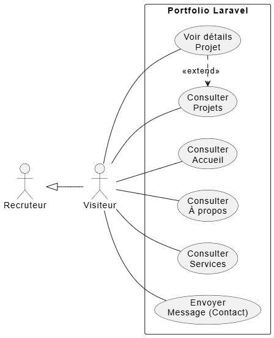
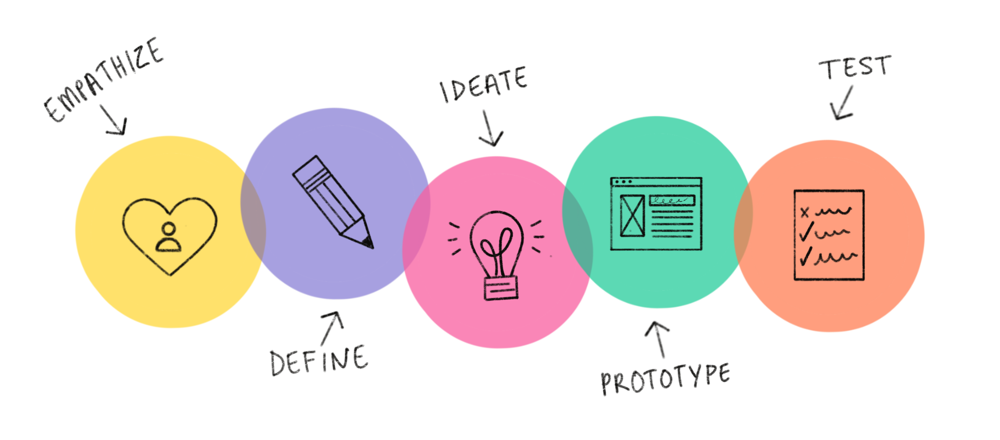
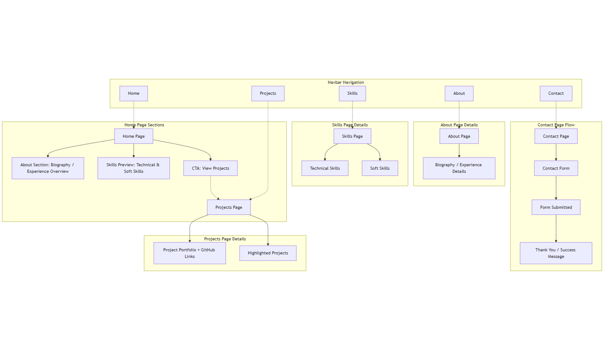
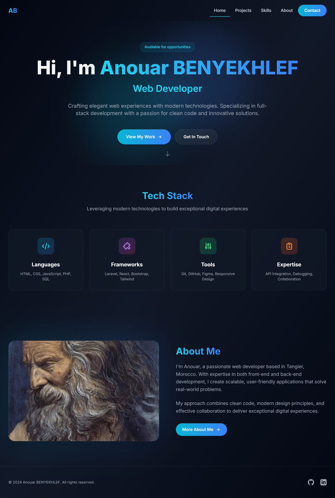

# Portfolio Développeur

**Benykhlef Anouar**  
Encadré par: **M. Essarraj Fouad**  
DM101  

---

# Analyse

---

## Cahier des charges

**Contexte du projet**  
Site portfolio personnel pour présenter :  
- Compétences  
- Réalisations  
- Parcours de **Aziz Soufiane**

**Objectif**  
Créer une vitrine professionnelle claire.  
**Profil développeur :** nom, bio, compétences  
**Contenu :** liste de projets + détails projet  
Page **À propos / Contact**

---

# Cible utilisateur

- Recruteurs  
- Partenaires  
- Clients potentiels  

**Périmètre fonctionnel**  
- Minimum 3 pages :  
  - Accueil  
  - Projets / Détail projet  
  - À propos / Contact

---

# Étude de l’existant

## Exemple de site inspirant

---

# Diagramme de cas d'utilisation

---

# Conception

---

## Design Thinking

---

1. 🟡 **Empathize** — Comprendre les utilisateurs : besoins, émotions, problèmes  

2. 🟣 **Define** — Définir clairement le problème à résoudre  

3. 🟢 **Ideate** — Générer plusieurs idées créatives  

4. 🔵 **Prototype** — Créer des versions simples ou maquettes 
 
5. 🟠 **Test** — Tester les prototypes et apprendre des retours  

---

# Schéma

---

# Maquette

---

# Merci
