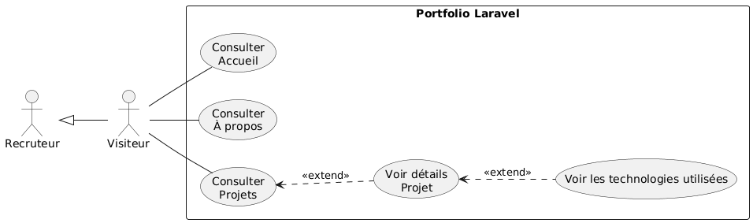
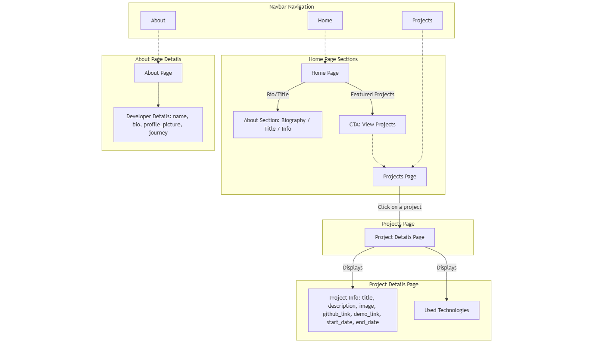
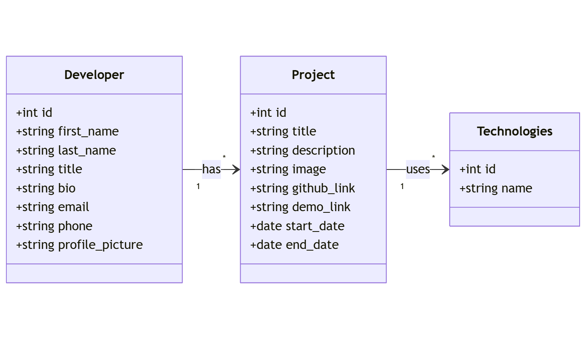

# Portfolio Développeur

**Benykhlef Anouar**  
Encadré par: **M. Essarraj Fouad**  
DM101  

---

# Analyse

---

## Cahier des charges

**Contexte du projet**  
Site portfolio personnel pour présenter :  
- Compétences  
- Réalisations  
- Parcours de **Aziz Soufiane**

**Objectif**  
Créer une vitrine professionnelle claire.  
**Profil développeur :** nom, bio, compétences  
**Contenu :** liste de projets + détails projet  
Page **À propos / Contact**

---

# Cible utilisateur

- Recruteurs  
- Partenaires  
- Clients potentiels  

**Périmètre fonctionnel**  
- Minimum 3 pages :  
  - Accueil  
  - Projets / Détail projet  
  - À propos / Contact

---

# Étude de l’existant

## Exemple de site inspirant

<figure>
  
  <figcaption>Figure 1 – Exemple de site portfolio inspirant</figcaption>
</figure>

---

# Diagramme de cas d'utilisation

<figure>
  
  <figcaption>Figure 2 – Diagramme de cas d'utilisation du site portfolio</figcaption>
</figure>

---

# Conception

---

## Design Thinking

<figure>
  
  <figcaption>Figure 3 – Étapes du Design Thinking</figcaption>
</figure>

---

1. 🟡 **Empathize** — Comprendre les utilisateurs : besoins, émotions, problèmes 

2. 🟣 **Define** — Définir clairement le problème à résoudre  

3. 🟢 **Ideate** — Générer plusieurs idées créatives 

4. 🔵 **Prototype** — Créer des versions simples ou maquettes  

5. 🟠 **Test** — Tester les prototypes et apprendre des retours  

---

# Schéma

<figure>
  
  <figcaption>Figure 4 – Schéma général de l’architecture du site</figcaption>
</figure>

---

# Maquette

<figure>
  
  <figcaption>Figure 5 – Maquette de la page d’accueil</figcaption>
</figure>

---

# Diagramme de classe

<figure>
  
  <figcaption>Figure 6 – Diagramme de classes du projet</figcaption>
</figure>

---

# Merci

